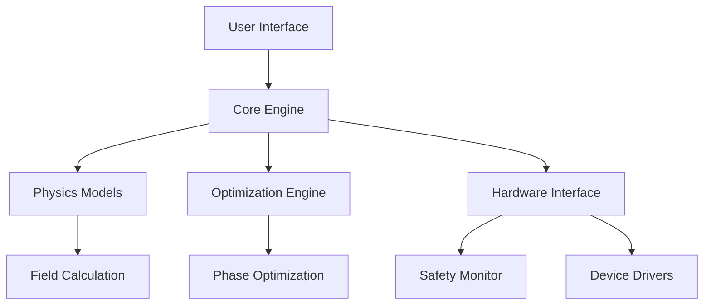

# Acousto-Gen Architecture

## System Overview

Acousto-Gen is a modular framework for generating acoustic holograms using ultrasonic transducer arrays. The system enables precise control of 3D acoustic fields for applications in levitation, haptics, and medical therapeutics.

## Core Architecture

### High-Level Components



### Module Structure

```
acousto_gen/
├── core.py                 # Core holography algorithms and interfaces
├── cli.py                  # Command-line interface and user interaction
├── physics/                # Physical modeling and simulation
│   ├── propagation.py      # Wave propagation calculations
│   ├── transducers.py      # Transducer array modeling
│   ├── medium.py           # Acoustic medium properties
│   └── fields.py           # Acoustic field representations
├── optimization/           # Optimization algorithms
│   ├── gradient.py         # Gradient-based optimization
│   ├── genetic.py          # Evolutionary algorithms
│   ├── neural.py           # Neural network optimization
│   └── constraints.py      # Safety and physical constraints
├── models/                 # Machine learning models
│   ├── generators.py       # Generative neural networks
│   ├── forward.py          # Forward modeling networks
│   ├── inverse.py          # Inverse problem solvers
│   └── training.py         # Model training utilities
├── hardware/               # Hardware integration layer
│   ├── drivers/            # Device-specific drivers
│   ├── arrays/             # Array configuration management
│   ├── safety/             # Safety monitoring systems
│   └── calibration.py      # Array calibration procedures
└── applications/           # Application-specific modules
    ├── levitation.py       # Acoustic levitation control
    ├── haptics.py          # Mid-air haptic rendering
    ├── medical.py          # Medical focused ultrasound
    └── visualization.py    # Real-time field visualization
```

## Design Principles

### 1. Modular Architecture
- **Single Responsibility**: Each module has a clearly defined purpose
- **Loose Coupling**: Minimal dependencies between components
- **High Cohesion**: Related functionality grouped together
- **Interface Segregation**: Clean, focused APIs

### 2. Performance-First Design
- **GPU Acceleration**: CUDA-based computation for large-scale optimization
- **Vectorized Operations**: NumPy/PyTorch for efficient array operations
- **Memory Optimization**: Streaming computation for large datasets
- **JIT Compilation**: Numba acceleration for critical performance paths

### 3. Safety and Reliability
- **Hardware Safety**: Built-in pressure and temperature limits
- **Input Validation**: Comprehensive parameter checking
- **Error Handling**: Graceful degradation and recovery
- **Audit Logging**: Complete operation traceability

### 4. Extensibility
- **Plugin Architecture**: Easy integration of new hardware
- **Algorithm Registry**: Pluggable optimization methods
- **Custom Physics**: Support for specialized propagation models
- **Application Framework**: Template for new use cases

## Data Flow Architecture

### Primary Processing Pipeline

1. **Target Specification**
   - User defines desired acoustic field
   - Validation of physical feasibility
   - Conversion to internal representation

2. **Physics Modeling**
   - Calculate Green's functions for array geometry
   - Model wave propagation in medium
   - Apply boundary conditions and constraints

3. **Optimization Process**
   - Initialize phase distribution
   - Iterative improvement using selected algorithm
   - Real-time convergence monitoring

4. **Safety Validation**
   - Check pressure limits and exposure duration
   - Validate against regulatory constraints
   - Generate safety warnings and recommendations

5. **Hardware Control**
   - Convert phases to device-specific format
   - Apply calibration corrections
   - Stream data to transducer array

6. **Real-Time Monitoring**
   - Field measurement and feedback
   - Performance metrics collection
   - Safety system oversight

### Data Structures

#### AcousticField
```python
class AcousticField:
    pressure: np.ndarray      # 3D pressure field (Pa)
    velocity: np.ndarray      # 3D velocity field (m/s)
    intensity: np.ndarray     # Acoustic intensity (W/m²)
    coordinates: Coordinates  # Spatial coordinate system
    frequency: float          # Operating frequency (Hz)
    timestamp: float          # Field calculation time
```

#### TransducerArray
```python
class TransducerArray:
    positions: np.ndarray     # Element positions (m)
    orientations: np.ndarray  # Element orientations (rad)
    phases: np.ndarray        # Current phases (rad)
    amplitudes: np.ndarray    # Current amplitudes (0-1)
    frequency: float          # Operating frequency (Hz)
    calibration: CalibData    # Calibration parameters
```

## Component Interactions

### Core Engine
- **AcousticHologram**: Main user interface class
- **FieldCalculator**: Physics-based field computation
- **OptimizationManager**: Algorithm coordination
- **HardwareController**: Device interface management

### Physics Models
- **GreenFunction**: Free-field propagation kernels
- **BoundaryConditions**: Reflection and absorption
- **NonlinearEffects**: High-amplitude propagation
- **MediumProperties**: Material-specific parameters

### Optimization Algorithms
- **GradientDescent**: Standard gradient-based methods
- **EvolutionaryAlgorithms**: Population-based optimization
- **NeuralOptimization**: Learning-based approaches
- **HybridMethods**: Combined algorithm strategies

### Hardware Interface
- **DeviceRegistry**: Available hardware catalog
- **SafetyMonitor**: Real-time safety checking
- **CalibrationManager**: Array characterization
- **StreamingInterface**: High-bandwidth data transfer

## Scalability Considerations

### Computational Scaling
- **Multi-GPU Support**: Distributed computation across devices
- **Batch Processing**: Simultaneous optimization of multiple targets
- **Memory Management**: Efficient handling of large acoustic fields
- **Precision Control**: Adaptive precision for speed/accuracy trade-offs

### Hardware Scaling
- **Array Size**: Support for arrays from 64 to 10,000+ elements
- **Update Rates**: Real-time control up to 10 kHz update rates
- **Multi-Array**: Coordination of multiple transducer systems
- **Distributed Control**: Network-based array management

## Security and Safety

### Safety Systems
- **Pressure Limiting**: Automatic power reduction for safety
- **Temperature Monitoring**: Thermal protection for arrays
- **Exposure Limits**: Compliance with acoustic safety standards
- **Emergency Shutdown**: Immediate system disable capability

### Data Security
- **Input Sanitization**: Protection against malicious input
- **Access Control**: User authentication and authorization
- **Audit Logging**: Complete operation history
- **Secure Communication**: Encrypted hardware interfaces

## Future Architecture Enhancements

### Planned Improvements
- **Federated Learning**: Distributed model training
- **Edge Computing**: On-device optimization
- **Cloud Integration**: Remote computation resources
- **Real-Time Adaptation**: Dynamic field adjustment

### Research Directions
- **Quantum Optimization**: Quantum computing acceleration
- **Bio-Feedback**: Physiological response integration
- **AI-Assisted Design**: Automated hologram generation
- **Digital Twins**: Virtual array modeling

## Configuration Management

### System Configuration
```yaml
# config/system.yaml
physics:
  precision: float64
  gpu_memory_limit: 8GB
  batch_size: 32

optimization:
  default_method: adam
  max_iterations: 1000
  convergence_threshold: 1e-6

safety:
  max_pressure: 4000  # Pa
  max_intensity: 10   # W/cm²
  temperature_limit: 40  # °C

hardware:
  update_rate: 1000   # Hz
  calibration_interval: 24  # hours
  safety_check_rate: 100    # Hz
```

### Application Configuration
```yaml
# config/applications.yaml
levitation:
  default_frequency: 40000  # Hz
  particle_tracking: true
  stability_threshold: 0.1

haptics:
  perception_frequency: 200  # Hz
  max_render_distance: 0.5   # m
  force_scaling: 1.0

medical:
  regulatory_mode: FDA
  max_exposure_time: 300     # seconds
  thermal_monitoring: true
```

This architecture provides a robust foundation for acoustic holography research while maintaining safety, performance, and extensibility as core principles.