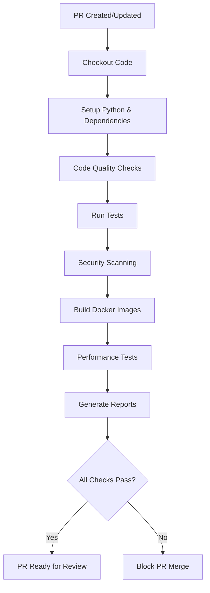
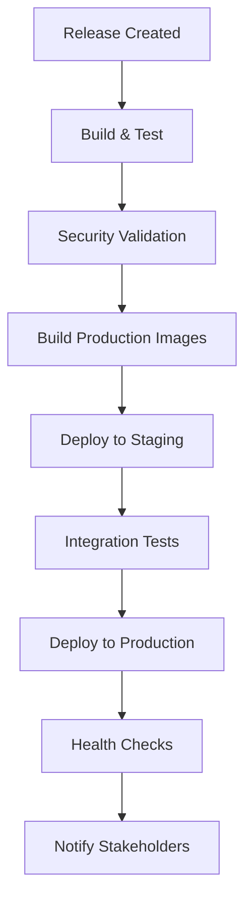

# CI/CD Workflows Documentation

## ⚠️ Manual Setup Required

Due to GitHub App permission limitations, the CI/CD workflows must be manually created by repository maintainers. This document provides complete workflow templates and setup instructions.

## Required GitHub Actions Workflows

The following workflows must be created in `.github/workflows/` directory:

### 1. CI Pipeline (`ci.yml`)
- **Purpose**: Pull request validation, testing, security scanning
- **Triggers**: Pull requests, pushes to main branch
- **Template**: [examples/ci.yml](examples/ci.yml)

### 2. CD Pipeline (`cd.yml`) 
- **Purpose**: Automated deployment and release management
- **Triggers**: Releases, tags, main branch pushes
- **Template**: [examples/cd.yml](examples/cd.yml)

### 3. Dependency Updates (`dependency-update.yml`)
- **Purpose**: Automated dependency management
- **Triggers**: Weekly schedule, manual dispatch
- **Template**: [examples/dependency-update.yml](examples/dependency-update.yml)

### 4. Security Scanning (`security-scan.yml`)
- **Purpose**: Comprehensive security analysis
- **Triggers**: Daily schedule, security-related changes
- **Template**: [examples/security-scan.yml](examples/security-scan.yml)

### 5. Performance Testing (`performance.yml`)
- **Purpose**: Performance regression detection
- **Triggers**: Performance-related changes, scheduled runs
- **Template**: [examples/performance.yml](examples/performance.yml)

## Setup Instructions

### Step 1: Copy Workflow Files

```bash
# Copy all workflow templates to .github/workflows/
cp docs/workflows/examples/*.yml .github/workflows/

# Verify files are in correct location
ls -la .github/workflows/
```

### Step 2: Configure Secrets

Add these secrets in GitHub repository settings:

#### Required Secrets
- `CODECOV_TOKEN`: For code coverage reporting
- `DOCKER_USERNAME`: Docker Hub username
- `DOCKER_PASSWORD`: Docker Hub password/token
- `NPM_TOKEN`: NPM publishing token (if applicable)
- `SLACK_WEBHOOK`: Slack notifications webhook
- `SAFETY_WEBHOOK`: Critical safety alert webhook

#### Optional Secrets
- `SENTRY_DSN`: Error tracking integration
- `DATADOG_API_KEY`: Performance monitoring
- `AWS_ACCESS_KEY_ID`: Cloud deployment
- `AWS_SECRET_ACCESS_KEY`: Cloud deployment
- `TERRAFORM_TOKEN`: Infrastructure management

### Step 3: Configure Branch Protection

Enable branch protection for `main` branch:

```yaml
# Branch protection rules
protection_rules:
  main:
    required_status_checks:
      - "ci/tests"
      - "ci/security-scan" 
      - "ci/docker-build"
    required_reviews: 2
    dismiss_stale_reviews: true
    require_code_owner_reviews: true
    enforce_admins: false
    allow_force_pushes: false
    allow_deletions: false
```

### Step 4: Configure Environments

Create deployment environments:

#### Staging Environment
- **Protection rules**: Require approval from maintainers
- **Secrets**: Staging deployment credentials
- **Variables**: Staging configuration

#### Production Environment  
- **Protection rules**: Require approval from 2+ maintainers
- **Secrets**: Production deployment credentials
- **Variables**: Production configuration

### Step 5: Enable Security Features

Enable GitHub security features:
- [x] Dependency graph
- [x] Dependabot alerts
- [x] Dependabot security updates
- [x] Secret scanning
- [x] Code scanning (CodeQL)

## Workflow Architecture

### CI Pipeline Flow



### CD Pipeline Flow



## Workflow Templates

### Basic CI Template

```yaml
name: CI
on:
  pull_request:
  push:
    branches: [main]

jobs:
  test:
    runs-on: ubuntu-latest
    steps:
      - uses: actions/checkout@v4
      - uses: actions/setup-python@v4
        with:
          python-version: '3.11'
      - name: Install dependencies
        run: pip install -e .[dev]
      - name: Run tests
        run: pytest --cov=acousto_gen
      - name: Security scan
        run: bandit -r acousto_gen/
```

### Advanced CI with Matrix

```yaml
strategy:
  matrix:
    python-version: ['3.9', '3.10', '3.11', '3.12']
    os: [ubuntu-latest, windows-latest, macos-latest]
    include:
      - os: ubuntu-latest
        python-version: '3.11'
        run-integration: true
```

## Quality Gates

### Required Checks
- [x] **Unit Tests**: >95% coverage
- [x] **Integration Tests**: All scenarios pass
- [x] **Code Quality**: Ruff linting passes
- [x] **Type Checking**: MyPy validation passes
- [x] **Security Scan**: No high/critical vulnerabilities
- [x] **Docker Build**: Images build successfully
- [x] **Documentation**: Links and formatting valid

### Performance Thresholds
- [x] **Optimization Speed**: <10s for 256 elements
- [x] **Memory Usage**: <4GB peak usage
- [x] **Build Time**: <5 minutes total CI time
- [x] **Image Size**: <2GB production image

### Security Requirements  
- [x] **Dependency Scan**: No known vulnerabilities
- [x] **Secret Detection**: No secrets in code
- [x] **License Compliance**: All dependencies compatible
- [x] **SBOM Generation**: Software bill of materials created

## Deployment Strategy

### Environment Promotion

```
Feature Branch → Main → Staging → Production
      ↓           ↓        ↓         ↓
   Dev Tests   CI Tests  E2E Tests Production
```

### Rollback Strategy

```yaml
# Automated rollback triggers
rollback_triggers:
  - error_rate > 5%
  - response_time > 2s
  - health_check_failures > 3
  - manual_trigger
```

## Monitoring Integration

### Deployment Monitoring
- Application health checks
- Performance metric validation
- Error rate monitoring
- User experience validation

### Alert Integration
```yaml
# Deployment alerts
alerts:
  deployment_failed:
    severity: critical
    channels: [slack, email, pagerduty]
  
  performance_degraded:
    severity: warning
    channels: [slack]
```

## Troubleshooting

### Common Issues

#### Workflow Not Triggering
```bash
# Check workflow syntax
gh workflow list
gh workflow view ci.yml

# Validate workflow file
yamllint .github/workflows/ci.yml
```

#### Test Failures
```bash
# Run tests locally first
make test
make test-cov

# Check test environment
python -m pytest --collect-only
```

#### Security Scan Failures
```bash
# Run security scans locally
make security-scan

# Check for false positives
bandit -r acousto_gen/ -f json
```

#### Docker Build Issues
```bash
# Test build locally
docker build --target development .
docker build --target production .

# Check build context
docker build --no-cache --progress=plain .
```

### Debug Mode

Enable workflow debugging:
```yaml
env:
  ACTIONS_STEP_DEBUG: true
  ACTIONS_RUNNER_DEBUG: true
```

## Maintenance

### Regular Tasks
- [ ] Review workflow performance monthly
- [ ] Update action versions quarterly
- [ ] Audit security configurations annually
- [ ] Update documentation when workflows change

### Performance Optimization
- Use action caching effectively
- Minimize workflow triggers
- Parallelize independent jobs
- Optimize Docker layer caching

## Compliance and Governance

### Audit Requirements
- Workflow execution logs retained 90 days
- All changes tracked in version control
- Approval processes documented
- Security scans archived

### Change Management
- All workflow changes require PR review
- Breaking changes require advance notice
- Production deployments require approval
- Emergency procedures documented

## Migration Guide

### From Existing CI/CD
1. **Assessment**: Review current workflows
2. **Mapping**: Map existing jobs to new structure
3. **Testing**: Validate new workflows in staging
4. **Migration**: Gradual rollout with fallback
5. **Cleanup**: Remove deprecated workflows

### Platform Migration
- Document platform-specific configurations
- Test cross-platform compatibility
- Validate security configurations
- Update team training materials

For detailed workflow configurations, see the [examples](examples/) directory.